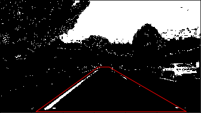

## SDC - Project 4

### Report

---

**Advanced Lane Finding Project**

The goals / steps of this project are the following:

* Compute the camera calibration matrix and distortion coefficients given a set of chessboard images.
* Apply a distortion correction to raw images.
* Use color transforms, gradients, etc., to create a thresholded binary image.
* Apply a perspective transform to rectify binary image ("birds-eye view").
* Detect lane pixels and fit to find the lane boundary.
* Determine the curvature of the lane and vehicle position with respect to center.
* Warp the detected lane boundaries back onto the original image.
* Output visual display of the lane boundaries and numerical estimation of lane curvature and vehicle position.

---

** [Rubric](https://review.udacity.com/#!/rubrics/571/view) Points **

The following section contains an overview of the structure of the code and addresses all the rubric points/questions.

** Source Code Overview **
The source code is mainly divided between the following files:
* `calibrate.py`:
  * Contains code to calibrate and correct the camera len's distortion


* `pipeline.py`:
  * Contains the code to run the entire pipeline from distortion correction to drawing the detected lane lines on the road.


* `P4-submit.ipynb`:
  * Notebook environment to run the code.


* `output_images/`:
  * Folder that contains all the intermediate result images that are used in this report.

** Camera Calibration **

> [1] Briefly state how you computed the camera matrix and distortion coefficients. Provide an example of a distortion corrected calibration image.

The code for this step is contained in the following function:
* `camera_calibration.calibrate`


The function takes in a path to a set of calibration and performs the following steps:

* `imagepoints` (which represent the points in the image space) and the `objpoints` (which represent the points in the transformed/calibrated space) are first prepared. For each image in the set of calibration images, which consist of chessboard patterns, the image is converted into gray scale and the corners of the chessboard are found.

<p align="center">
  
  <p align="center">Distorted chessboard calibration image</p>
</p>

* These corners are appended to the `imagepoints` and they correspond to the corners of a rectangle in the x,y coordinate system with the z-axis set to `z=0`.

<p align="center">
  
  <p align="center">Chessboard corners in distorted image for calibration</p>
</p>

* Now that we have a mapping between the corners identified in the camera image and the target corners in the x,y plane, the camera can be calibrated using the `imagepoints` and the `objpoints`.

<p align="center">
  
  <p align="center">Undistorted image</p>
</p>

* Once calibrated, the calibration matrix and the distortion coefficients are used to `undistort` the image and perform a perspective transformation on the chessboard images to visually check if the calibration was accurately performed.

<p align="center">
  
  <p align="center">Perspective transformation and distortion correction applied to the chessboard image</p>
</p>

### Pipeline (single images)

> [1] Provide an example of a distortion-corrected image.

An example of the distortion correction applied to a test image using the calibration matrix and distortion coefficients from the camera calibration step.

<p align="center">
  
  <p align="center">Distorted test image</p>
</p>

<p align="center">
  
  <p align="center">Undistorted/Distortion Corrected test image</p>
</p>

> [2] Describe how (and identify where in your code) you used color transforms, gradients or other methods to create a thresholded binary image.  Provide an example of a binary image result.

The pipeline method responsible for creating the color and gradient transforms is as follows:
* `Pipeline.color_gradient_threshold_transform`

The above method creates the following variables:
* `R_binary`
  * A thresholded binary image of the RED channel of the image in RGB color space

  <p align="center">
    
    <p align="center">The yellow lane line and parts of the white lane lines are visible (binary 1) in the RED channel with a lot of noise</p>
  </p>

* `G_binary`
  * A thresholded binary image of the GREEN channel of the image in RGB color space

  <p align="center">
    
    <p align="center">The yellow lane line and parts of the white lane lines are visible (binary 1) in the GREEN channel with a lesser noise compared to RED</p>
  </p>

* `L_binary`
  * A thresholded binary image of the LIGHTNESS channel of the image in the HLS color space

  <p align="center">
    
    <p align="center">The yellow lane line and parts of the white lane lines are visible (binary 1) in the LIGHTNESS channel similar to the RED and GREEN channels.</p>
  </p>

* `S_binary`
  * A thresholded binary image of the SATURATION channel of the image in the HLS color space

  <p align="center">
    
    <p align="center">The yellow lane line and parts of the white lane lines are visible (binary 1) in the SATURATION channel and compared to the other binary images, the lane lines are more clearly visible in this channel.</p>
  </p>

* `gradx`
  * A thresholded binary image with Sobel operator applied in the X direction.

  <p align="center">
    
    <p align="center">This image shows that lines in the vertical direction are picked up pretty well.</p>
  </p>

* `dir_binary`
  * A thresholded binary image of the directional gradients.

  <p align="center">
    
    <p align="center"></p>
  </p>


In the above images, `S_binary` and `gradx` seem to best pick up the lane lines. But instead of limiting the use of just these two binary images, we can use a combination of the different binary images, by adding and removing some of the information contributed by them.

To create a thresholded image for the lane detection polynomial fit algorithm, we take a combination as follows:

```
thresholded_image = ((R_binary | G_binary | L_binary) & S_binary | (gradx & G_binary & L_binary & dir_binary))
```

* The `R`,`G` and `L` binary images are `OR`-ed together since they result in similar images.
* This is then combined with the `S` binary image to remove some of the noise associated with the `S` binary image
* This is further `OR`-ed with an `AND` combination of `gradx`, `G`, `L` and `dir` binary images.

The final result is as follows:

<p align="center">
  
  <p align="center">The lane lines are more prominently visible in the combined threshold image</p>
</p>

> [3] Describe how (and identify where in your code) you performed a perspective transform and provide an example of a transformed image.

To perform the perspective transformation, a small section of the thresholded image is first selected as follows:

<p align="center">
  
  <p align="center">A mask is created around the region of the lane (assuming that the camera is centered on the dashboard of the car)</p>
</p>

The pipeline method responsible for creating the color and gradient transforms is as follows:
* `Pipeline.perspective_transform` - Line 298

It uses two sets of points:
* `src` - The corners of the mask in the thresholded image.
* `dst` - The corners of the rectangle in the destination image (which is the perspective transformed birds-eye view image)

The corners in the src image are chosen as follows:
```
left_bottom = [xsize*CONFIG['mask']['lb_x'], ysize*CONFIG['mask']['lb_y']]
right_bottom = [xsize*CONFIG['mask']['rb_x'], ysize*CONFIG['mask']['rb_y']]

left_top = [xsize*CONFIG['mask']['lt_x'], ysize*CONFIG['mask']['lt_y']]
right_top = [xsize*CONFIG['mask']['rt_x'], ysize*CONFIG['mask']['rt_y']]

x = [left_bottom[0], right_bottom[0], right_top[0], left_top[0], left_bottom[0]]
y = [left_bottom[1], right_bottom[1], right_top[1], left_top[1],  left_bottom[1]]
```

The CONFIG object defines the mask coordinates as percentage values:

```
CONFIG = {
    'mask': {
        'lt_y': 0.6,
        'lt_x': 0.49,
        'rt_y': 0.6,
        'rt_x': 0.545,

        'lb_x': 0.18,
        'lb_y': 1,        
        'rb_x': 0.93,
        'rb_y': 1
    }
}
```

The corresponding coordinates of `dst` are computed as follows:
```
w, h = image.shape[1::-1]
top = -3; bottom = 1; left = 0.3; right = 0.7

src = np.float32([corners[3],corners[2],corners[1],corners[0]])
dst = np.float32([[w*left, h*top],[w*right, h*top],[w*right, h*bottom],[w*left, h*bottom]])
```

This resulted in the following source and destination points:

| Source        | Destination   |
|:-------------:|:-------------:|
| 627, 427      | 384, -2160        |
| 697, 427      | 896, -2169      |
| 1190, 712     | 896, 720      |
| 230, 712     | 384, 720        |

I verified that my perspective transform was working as expected by drawing the `src` and `dst` points onto a test image and its warped counterpart to verify that the lines appear parallel in the warped image.

<p align="center">
  
  <p align="center">The lane lines appear parallel in the perspective transformed image</p>
</p>

> [4] Describe how (and identify where in your code) you identified lane-line pixels and fit their positions with a polynomial?

To identify the lane lines I implemented a method to use the perspective transformed image to detect lane lines by:
* Finding a histogram of raw intensities for the bottom half of the image

    * Computing the positions of peaks of the image intensities which roughly should correspond to the lane
    lines. The histogram is divided vertically to find 2 peaks, the first peak is for the left lane line and the second is for the right lane line.

    * Step through small windows in the Y direction, by moving the centers of the windows based on the number
    of pixels within the the window and append the pixels within this image to an array that would potentially
    identify the lane lines.

    <p align="center">
      
      <p align="center">Small windows drawn vertically based on histogram peaks.</p>
    </p>

    * Once these arrays have all the image pixels that potentially correspond to the lane line points, the problem now becomes a line fitting problem to a distribution of points in a plane.

    <p align="center">
      
      <p align="center">Small windows drawn vertically based on histogram peaks.</p>
    </p>

    * 2nd degree polynomials are fit to these sets of points (for each lane line).

    * The current fit is saved for the next frame.

The part of the code responsible for detecting lines is as follows:
* `pipeline.Pipeline.detect_lane_lines` - Detects lane line on the first frame
* `pipeline.Pipeline.detect_lane_lines_with_prior` - - Detects lane line on all the future frames by using the previous frame's lane line fit.

Once we have the first frame's lane line fit, we consider the issues and solutions for the frames after the first lane line detection has been made:

* One problem that I came across here was that despite fitting the lane lines accurately in the first frame, future frames were not always guaranteed to have an accurate fit for either of the lines, due to change in the curvature of the road.

* A solution to this problem was to use the fit from the previous frame and create points along the fit on the new image, so, together with the points in the new frame, the resulting point distribution would be closer to the actual lane line.

* Additionally, instead of re-running the stepping through all the windows, we can use the points from the previous frame's lane line fit and search within a margin.

![alt text][image5]

> [5] Describe how (and identify where in your code) you calculated the radius of curvature of the lane and the position of the vehicle with respect to center.

I did this in lines # through # in my code in `my_other_file.py`

> [6] Provide an example image of your result plotted back down onto the road such that the lane area is identified clearly.

I implemented this step in lines # through # in my code in `yet_another_file.py` in the function `map_lane()`.  Here is an example of my result on a test image:

![alt text][image6]

---

### Pipeline (video)

> [1] Provide a link to your final video output.  Your pipeline should perform reasonably well on the entire project video (wobbly lines are ok but no catastrophic failures that would cause the car to drive off the road!).

Here's a [link to my video result](./project_video.mp4)

---

### Discussion

> [1] Briefly discuss any problems / issues you faced in your implementation of this project.  Where will your pipeline likely fail?  What could you do to make it more robust?

Here I'll talk about the approach I took, what techniques I used, what worked and why, where the pipeline might fail and how I might improve it if I were going to pursue this project further.
